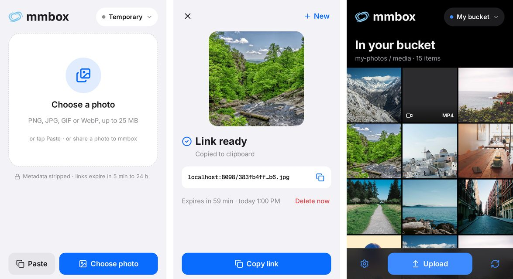

# mmbox

A phone-friendly viewer and uploader for any S3-compatible bucket, plus self-deleting image links when you have no bucket.



- **No bucket:** drop or paste an image and get a link that deletes itself after 5 minutes to 24 hours. Location and camera data are stripped.
- **Your bucket** (R2, S3, RustFS, MinIO, B2, ...): paste the endpoint and a key, then browse, upload, view and delete. With CORS on the bucket, the browser talks to it directly (any size, video included); without CORS, the server relays images.
- No accounts. Keys stay in your browser.

## Run

```sh
cp .env.example .env
docker compose up --build -d
```

The app listens on port 8099. Serve it over https behind any proxy (Caddy, nginx, Cloudflare Tunnel): buckets require it.

## Configure

Everything is optional except `REDIS_URL`; see `.env.example` for the full list.

| Variable | Default | |
| --- | --- | --- |
| `PROXY_TRUSTED_CIDRS` | none | Exact proxy addresses whose client-IP header is trusted, e.g. `["172.18.0.5/32"]` |
| `PROXY_CLIENT_IP_HEADER` | `cf-connecting-ip` | That header |
| `MEDIA_MAX_SIZE_BYTES` | 25 MiB | Largest upload |
| `RATE_LIMITS_UPLOADS_PER_HOUR` | 30 | Per client IP |

Self-deleting images live in Redis without persistence: a restart forgets them.

## Bucket CORS

For direct uploads, the setup sheet shows the CORS policy and a one-line `aws s3api put-bucket-cors` command for your bucket. A bucket on your laptop works through a tunnel (`cloudflared tunnel --url http://localhost:9000` or `tailscale funnel`).

## API

```sh
curl -F file=@photo.png -F ttl=3600 https://mmbox.example/api/upload
# {"url": "/<id>.png", "expires_at": "...", "delete_token": "..."}
curl -X DELETE -H "X-Delete-Token: <token>" https://mmbox.example/api/media/<id>
```

`ttl` is one of 300, 900, 1800, 3600, 10800, 21600, 43200, 86400 seconds.

## Develop

```sh
uv sync --project backend && uv run --project backend pre-commit install
(cd frontend && npm install && npm run dev)   # proxies /api to localhost:8099
```

Contributor rules: `AGENTS.md`.

## License

MIT. Icons: [Rune Icons](https://github.com/Runeicons/runeicons) (Apache-2.0). Image editor: [marker.js](https://markerjs.com) (linkware, attribution shown in the editor).
